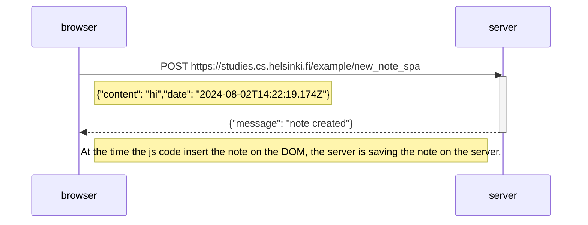

```mermaid
sequenceDiagram
    participant browser
    participant server

    browser->>server: POST https://studies.cs.helsinki.fi/example/new_note_spa
    activate server
    Note right of browser: {"content": "hi","date": "2024-08-02T14:22:19.174Z"}
    server-->>browser: {"message": "note created"}
    deactivate server

    Note right of browser: At the time the js code insert the note on the DOM, the server is saving the note on the server.
```